# Todo
- [x] Git 101
- [x] 'Refatorar' Git 101 
- [ ] Adicionar refs
- [x] Testar Git 101 no Windows
- [x] Fork e Pull Request
- [x] Como instalar o Anaconda e o labelme
- [x] Como usar o labelme
- [ ] Guideline de segmentação


# PCA Coin label


## Preparando o ambiente de trabalho
Esse link possui outras formas de instalar o labelme.
[Link do repositório oficial](https://github.com/wkentaro/labelme)
### Ubuntu 19.10+ / Debian (sid)
Nas distribuições mais novas do Ubuntu e no Debian (sid),
o programa pode ser facilmente instalado com o comando abaixo:
```
sudo apt-get install labelme
```
### Windows e outras distribuições de Linux
Para instalar o programa nesses sistemas é necessário instalar o **Anaconda**, o Anaconda é uma distribuição de Python que facilita a instalação de programas e bibliotecas.

[Tutorial de Instalação no Windows e Ubuntu](https://minerandodados.com.br/instalar-python-anaconda/).

Após instalar o Anaconda, basta executar o(s) comando(s) abaixo:
```
$ conda install labelme -c conda-forge

#caso esteja usando Windows é necessário instalar o pillow 4
$ conda install pillow=4.0.0
```
### MacOs
```
$ brew install pyqt  
$ pip install labelme
```

## Git & Github 101

### Conceitos
**Git** é um programa de versionamento de software que facilita a vida de qualquer programador/desenvolvedor,
trata-se de uma ferramenta que localiza mudanças em arquivos do projeto e coordena o trabalho 
realizado pelas pessoas envolvidas no projeto.

**Github** é uma plataforma web que permite a hospedagem de projetos utilizando a ferramenta Git,
essa plataforma é usada para facilitar o desenvolvimento de um projeto, pois oferece funcionalidades
extras ao git e também permite o acesso ao código fonte de softwares *open-source*.


### First Repo
Nessa seção, veremos como criar e usar um repositorio no github.
  
#### Passo 0.1: Criar uma conta no Github
Para usar o github é necessário uma conta, estudantes da UEA tem direito ao Github Pro,
que permite a criação de repositórios privados. 

[Como conseguir a licença de estudante](https://www.treinaweb.com.br/blog/como-obter-uma-licenca-para-estudante-no-github/), caso já tenha uma conta com outro email é possível linkar a conta da universidade e conseguir a licença.


#### Passo 0.2: Instalando e configurando o Git
[Como instalar o Git para Windows/Mac/Linux](https://git-scm.com/book/pt-br/v1/Primeiros-passos-Instalando-Git)

Para configurar o git, basta executar os seguintes comandos no terminal:
```
# o $ indica o inicio do comando, nao digite ele
# '#' inicia comentarios
$ git config --global user.name "username_usado_no_git"
$ git config --global user.email "iniciais@curso.uea.edu.br"
```

#### Passo 1: Inicializando o repositório

No terminal basta executar essa sequência de comandos:
```
$ mkdir repo    #cria o diretorio do repositorio
$ cd repo       #entra no dir
$ git init      # inicializa o git
Initialized empty Git repository in /home/yonekura/Documents/repo/.git/
```

#### Passo 2: Mudanças
Agora que temos o repo criado, precisamos colocar alguma coisa nele, em projetos open-source é comum a presença de um arquivo README.md, esse arquivo normalmente contém informações gerais sobre o projeto, requisitos para usar o software, e tutorias (como esse).

O README.md pode ser criado pelo terminal ou por um editor de texto:
``` 
$ touch README.md
 ```
 
Com o README.md criado, precisamos avisar para o Git que queremos "rastrear" o arquivo, isso é importante, pois arquivos não rastreados são ignorados pelo Git. Para ver a situação de um arquivo e rastrea-lo:
```
# para ver quais arquivos estao sendo rastreados
$ git status
On branch master
No commits yet
Untracked files:
  (use "git add <file>..." to include in what will be committed)
	README.md
nothing added to commit but untracked files present (use "git add" to track)

$ git add README.md
$ git status
On branch master
No commits yet
Changes to be committed:
  (use "git rm --cached <file>..." to unstage)
	new file:   README.md
```
#### Passo 3: First Commit
Agora que o git está rastreando o arquivo, podemos criar um commit, o commit funciona como um savepoint, ele pode restaurar o estado que o repo estava e depois voltar para o último commit (chamado de HEAD).

Para commitar o repo:
```
$ git commit -m "Mensagem do commit"
```
Existem boas práticas de como fazer uma mensagem de commit, não vou falar sobre.

#### Passo 4: Repositório no Github
Com o commit criado, o próximo passo é criar o repo no github.


1) Vá para a janela de repositórios.

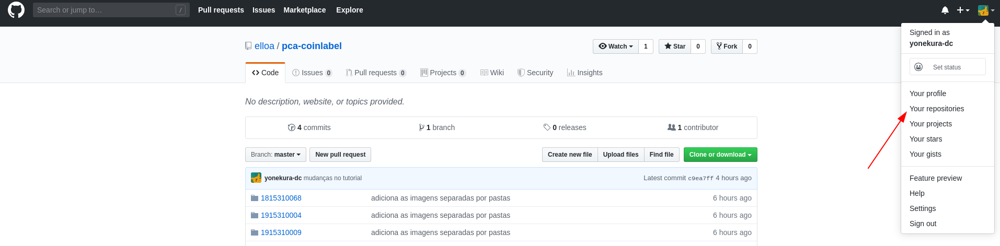
---

2) Crie um novo repo.

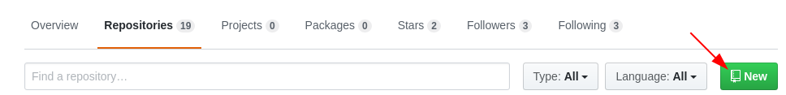
---

3) Escolha um nome para o repo e as configurações do mesmo (pode deixar as configs padrões).

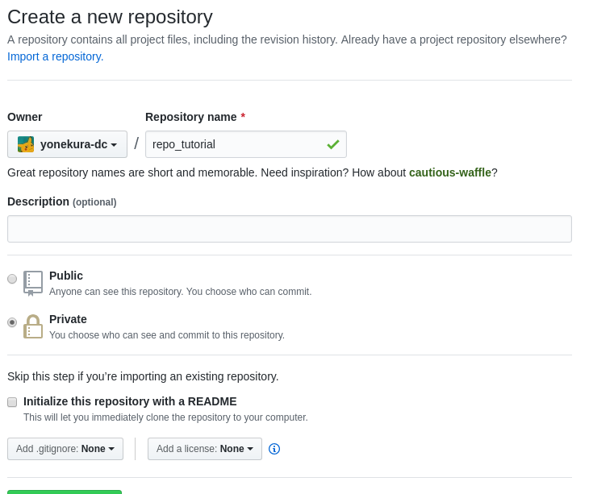
---

4) "Sincronizar" o git com o repo do github.
Quando o repo é criado e está vazio, 
ele apresenta uma tela com opções de como sincronizar o repo.
No nosso caso, basta executar os comando abaixos (os passos anteriores já foram feitos):
```
$ git remote add origin https://github.com/<username>/<repo_name.git> # Adiciona o endereco do repo do git
$ git push -u origin master # para atualizar o repo do github
```
Digite seu login e senha do Github.

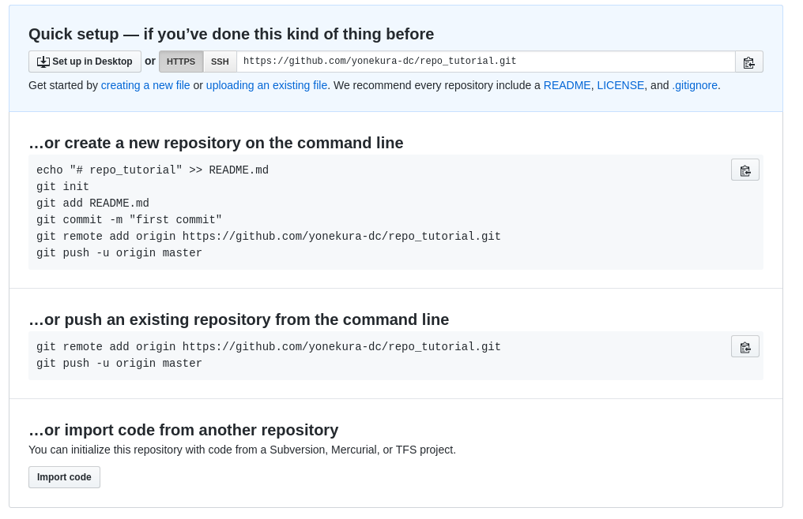
---

Se tudo deu certo, a tela de setup deixa de aparecer e o seu README.md ficará visível no repo do github.

#### Considerações

### Forks e Pull Requests
Para contribuir em projetos abertos é preciso ter o conhecimento sobre *Forks* e *Pull Requests*.
Um Fork é uma cópia de um repositório que permite alterações no projeto sem afetar o repo original,
normalmente é usado para propor mudanças para um projeto sem ser um *mantainer* (possuir permissão para alterar o código).
Um pull request é a formalização da proposição de mudança, que sera avaliada por um mantainer.

#### Fork
Para criar um Fork basta clicar no botão Fork:
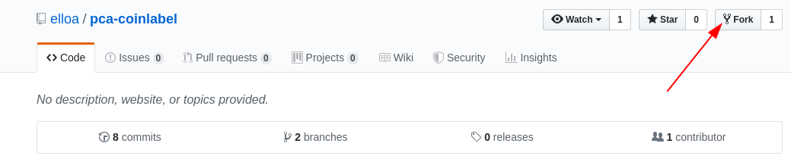

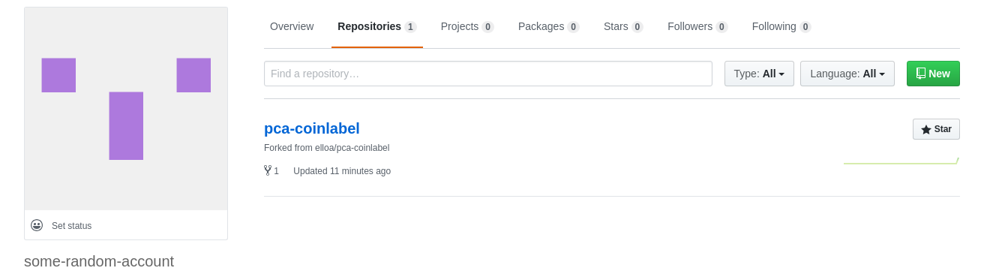

Agora basta criar um repo do git no seu computador e adicionar o fork.
É possivel adicionar o repo usando `git remote add origin ...`, porém, 
existe um comando que facilita esse processo.

No seu fork, clique em "Clone or download" e copie o link (tenha certeza que esta usando https)


No terminal, vá para onde quer criar o repo e execute:
```
$ git clone https://resto_do_link # cola o link
```

Esse Fork é onde o trabalho será feito, para depois ser adicionado ao repo original.

Como teste vá para o diretório com sua matrícula e crie um arquivo qualquer, add, commit e push no git.

```
$ touch file.txt
$ git add file.txt
$ git commit -m 'testando commit'
$ git push origin master
```
Verifique se o arquivo está presente no Fork do github.

#### Pull Request
Para criar um pull request, vá para o repo original e clique em "New pull request":

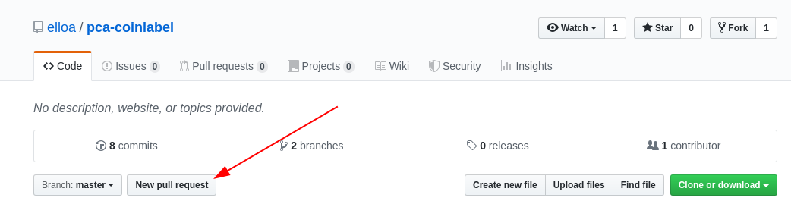

Clique em "compare across forks"

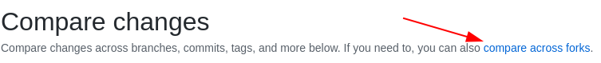

No dropdown de "head repository" escolha o seu fork.

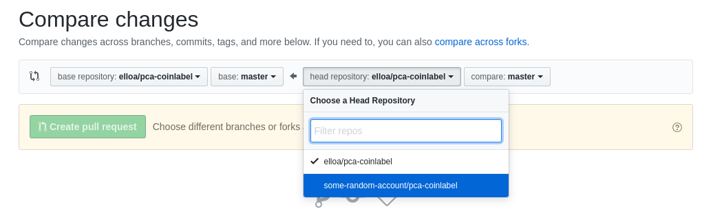

Escreva uma mensagem sobre o conteúdo do seu request,
verifique as mudanças propostas.

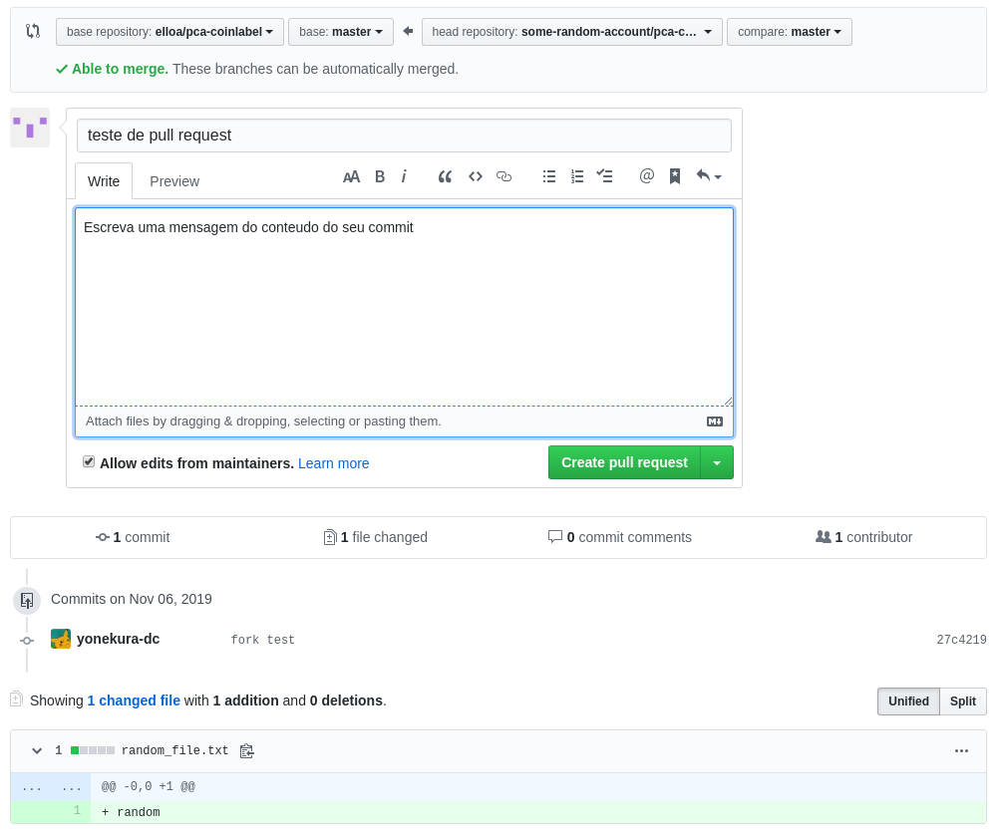

O pull request será avaliado conforme a disponibilidade dos mantainers.

Para treino, faça um Pull Request no repo.

## Usando o labelme
Com o Anaconda e o labelme instalado,
abra o terminal e vá para o seu diretório com as imagens dentro do seu fork,
depois execute o comando `labelme .` .

```
$ cd /endereço_do_dir/<Matricula>/
$ labelme . # o '.' indica que deve abrir todas as imagens do dir atual
```
Se o programa abrir e exibir os arquivos no lado esquerdo da tela, 
significa que a instalação foi efetuada com sucesso.

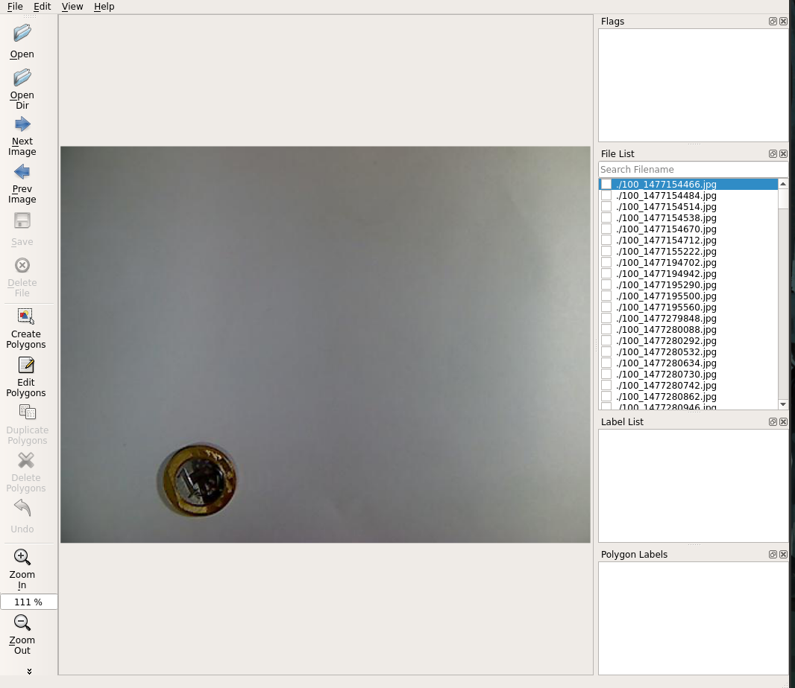

No lado direito da tela se encontra a File List e a Label List,
a File List ela exibe todos os arquivos abertos e indica se a imagen já foi rotulada,
e a Label List mostra todos os rótulos usados.

---

Para criar um rótulo, clique com o botão direito na imagem e selecione "Create Circle",
em seguida clique na imagem, isso irá marcar o centro do círculo, 
depois é preciso marcar o raio do círculo, basta clicar novamente.

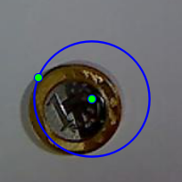

Uma janela aparecerá, o campo de cima é o input do rótulo da moeda (para moedas de 1 real, use '100'),
o campo de baixo contém todos os rótulos usados no projeto.

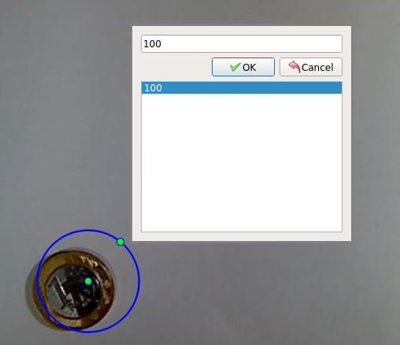

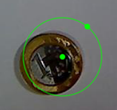
---

Para editar um rótulo, clique no botão direito e selecione "Edit Polygons",
para mudar o centro de lugar clique no centro da moeda e arraste,
para mudar o raio da moeda clique no ponto exterior da moeda e arraste.

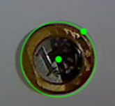

Para ir para a próxima imagem, clique em "Next Image" no lado esquerdo da tela,
salve o arquivo com o nome padrão. Quando o rótulo de uma imagem é criado e salvo,
um "check" fica ao lado do nome da imagem indicando que aquela imagem já esta rótulada.

Obs: É possível abilitar o salvamento automático das imagens, clique em File no canto superior esquerdo,
e ative a opção "Save Automatically".


<!---
https://www.freecodecamp.org/news/learn-the-basics-of-git-in-under-10-minutes-da548267cc91/
https://tableless.com.br/tudo-que-voce-queria-saber-sobre-git-e-github-mas-tinha-vergonha-de-perguntar/
-->
